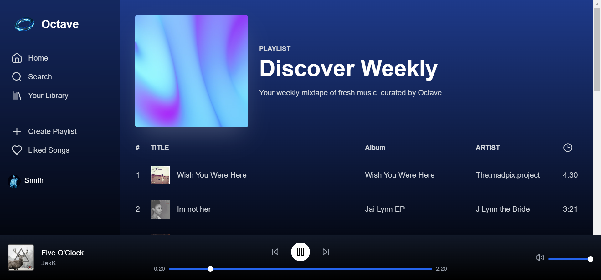

<div align="center">
<br/>

<br/>
  <div>
    
    
    
    
    

  </div>

<h3 align="center">Octave</h3>

<div align="center">
  <a href="">🌐View live demo🌐</a>
</div>

</div>

## 📋 <a name="table">Table of Contents</a>

1. 🤖 [Introduction](#introduction)
2. ⚙️ [Tech Stack](#tech-stack)
3. 🔋 [Features](#features)
4. 🤸 [Quick Start](#quick-start)


## <a name="introduction">🤖 Introduction</a>

Octave is more than just a music streaming service — it's the ultimate audio destination. Songs, podcasts and audiobooks. Whether you're a casual listener or an audiophile, Octave has something for everyone.

## <a name="tech-stack">⚙️ Tech Stack</a>

- React
- Next.js
- Jamendo 
- Firebase
- Zustand
- Clerk
- TailwindCSS
- TypeScript

## <a name="features">🔋 Features</a>

👉 **User Authentication & Management**: A comprehensive user management flow powered by Clerk.

👉 **Music Library**: Powered by the Jamendo api.

👉 **State Management**: Provided by zustand.

👉 **Music Player**: A full-featured built from scratch music player with play/pause, next/previous and shuffling.

👉 **Minimalistic Design**: Fresh and simple UI with only the essentials for ease of use and a clean aesthetic.

**Add More As the project grows!**

## <a name="quick-start">🤸 Quick Start</a>

Follow these steps to set up the project locally on your machine.

**Prerequisites**

Make sure you have the following installed on your machine:

- [Git](https://git-scm.com/)
- [Node.js](https://nodejs.org/en)
- [npm](https://www.npmjs.com/) (Node Package Manager)

**Cloning the Repository**

```bash
git clone https://github.com/0ddFl3xx/octave.git
cd octave
```

**Installation**

Install the project dependencies using npm:

```bash
npm i
```

**Set Up Environment Variables**
Create a file named `.env` in the root of your project and add:

```env
# Clerk
NEXT_PUBLIC_CLERK_PUBLISHABLE_KEY=
CLERK_SECRET_KEY=
NEXT_PUBLIC_CLERK_SIGN_IN_URL=/sign-in
NEXT_PUBLIC_CLERK_SIGN_UP_URL=/sign-up

# Jamendo
JAMENDO_KEY=
```
- To populate the Clerk keys, you can obtain these credentials by signing up & creating a new project on the [Clerk website](https://clerk.com/).
- To populate the Jamendo key, you can obtain it by signing up & creating a new project on the [Jamendo website](https://developer.jamendo.com/).

**NOTE:** Avoid committing your `.env` file to the repository.

Go to your `.gitignore` file and add the following line:

```env
# env files (can opt-in for commiting if needed)
.env*
```

**Running the Project**

```bash
npm run dev
```

Open [http://localhost:3000](http://localhost:3000) in your browser to view the project.